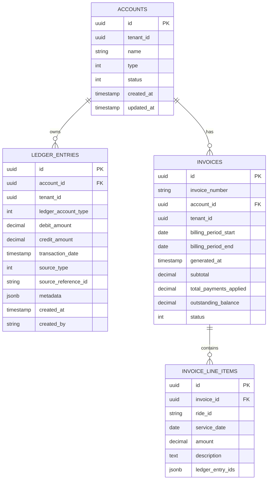

# Data Model: Dual-Entry Accounting & Invoicing Service

**Feature**: backend-api  
**Date**: 2026-02-06  
**Phase**: Phase 1 - Design & Contracts

This document defines the domain model, persistence model, and database schema for the accounting service.

---

## 1. Domain Model (Ubiquitous Language)

### 1.1 Aggregates

#### Account Aggregate

**Aggregate Root**: `Account`

The Account aggregate represents a financially responsible entity (organization or individual) and owns all ledger entries and invoices associated with it.

**Invariants**:
- Account ID must be unique per tenant
- Status changes must be valid (Active → Inactive only, never Inactive → Active without explicit reactivation)
- Ledger entries cannot be modified once created (append-only)
- For every charge/payment, total debits must equal total credits (double-entry accounting)

**Entities within Aggregate**:
- `Account` (root)
- `LedgerEntry` (child entity)

**Value Objects**:
- `Money`
- `AccountId`
- `RideId`
- `PaymentReferenceId`

**Domain Events**:
- `AccountCreated`
- `ChargeRecorded`
- `PaymentRecorded`
- `AccountDeactivated`

---

###1.2 Entities

#### Account (Aggregate Root)

```csharp
public class Account : AggregateRoot
{
    public AccountId Id { get; private set; }
    public string Name { get; private set; }
    public AccountType Type { get; private set; } // Organization | Individual
    public AccountStatus Status { get; private set; } // Active | Inactive
    public Guid TenantId { get; private set; }
    
    private readonly List<LedgerEntry> _ledgerEntries = new();
    public IReadOnlyCollection<LedgerEntry> LedgerEntries => _ledgerEntries.AsReadOnly();
    
    public DateTime CreatedAt { get; private init; }
    public DateTime? UpdatedAt { get; private set; }
    
    // Factory method
    public static Account Create(AccountId id, string name, AccountType type, Guid tenantId)
    {
        var account = new Account
        {
            Id = id,
            Name = name,
            Type = type,
            Status = AccountStatus.Active,
            TenantId = tenantId,
            CreatedAt = DateTime.UtcNow
        };
        
        account.RaiseDomainEvent(new AccountCreatedEvent(id, name, type, tenantId));
        return account;
    }
    
    // Domain methods
    public Result RecordCharge(RideId rideId, Money amount, DateTime serviceDate, string fleetId)
    {
        if (Status != AccountStatus.Active)
            return Result.Fail(AccountErrors.Inactive(Id));
            
        if (_ledgerEntries.Any(e => e.SourceReferenceId == rideId.Value && e.SourceType == SourceType.Ride))
            return Result.Fail(LedgerErrors.DuplicateCharge(rideId));
        
        var debitEntry = LedgerEntry.CreateDebit(
            ledgerAccount: LedgerAccountType.AccountsReceivable,
            amount: amount,
            sourceType: SourceType.Ride,
            sourceReferenceId: rideId.Value,
            transactionDate: serviceDate,
            metadata: new { FleetId = fleetId });
            
        var creditEntry = LedgerEntry.CreateCredit(
            ledgerAccount: LedgerAccountType.ServiceRevenue,
            amount: amount,
            sourceType: SourceType.Ride,
            sourceReferenceId: rideId.Value,
            transactionDate: serviceDate,
            metadata: new { FleetId = fleetId });
        
        _ledgerEntries.Add(debitEntry);
        _ledgerEntries.Add(creditEntry);
        
        RaiseDomainEvent(new ChargeRecordedEvent(Id, rideId, amount, serviceDate, fleetId));
        return Result.Success();
    }
    
    public Result RecordPayment(PaymentReferenceId paymentRefId, Money amount, DateTime paymentDate, string? paymentMode)
    {
        if (Status != AccountStatus.Active)
            return Result.Fail(AccountErrors.Inactive(Id));
            
        if (_ledgerEntries.Any(e => e.SourceReferenceId == paymentRefId.Value && e.SourceType == SourceType.Payment))
            return Result.Fail(LedgerErrors.DuplicatePayment(paymentRefId));
        
        var debitEntry = LedgerEntry.CreateDebit(
            ledgerAccount: LedgerAccountType.CashBank,
            amount: amount,
            sourceType: SourceType.Payment,
            sourceReferenceId: paymentRefId.Value,
            transactionDate: paymentDate,
            metadata: new { PaymentMode = paymentMode });
            
        var creditEntry = LedgerEntry.CreateCredit(
            ledgerAccount: LedgerAccountType.AccountsReceivable,
            amount: amount,
            sourceType: SourceType.Payment,
            sourceReferenceId: paymentRefId.Value,
            transactionDate: paymentDate,
            metadata: new { PaymentMode = paymentMode });
        
        _ledgerEntries.Add(debitEntry);
        _ledgerEntries.Add(creditEntry);
        
        RaiseDomainEvent(new PaymentRecordedEvent(Id, paymentRefId, amount, paymentDate));
        return Result.Success();
    }
    
    public Money CalculateBalance()
    {
        var totalDebits = _ledgerEntries.Where(e => e.DebitAmount != null).Sum(e => e.DebitAmount!.Amount);
        var totalCredits = _ledgerEntries.Where(e => e.CreditAmount != null).Sum(e => e.CreditAmount!.Amount);
        return new Money(totalDebits - totalCredits);
    }
    
    public void Deactivate()
    {
        if (Status == AccountStatus.Inactive)
            return;
            
        Status = AccountStatus.Inactive;
        UpdatedAt = DateTime.UtcNow;
        RaiseDomainEvent(new AccountDeactivatedEvent(Id));
    }
}
```

#### LedgerEntry (Entity)

```csharp
public class LedgerEntry : Entity
{
    public Guid Id { get; private set; }
    public AccountId AccountId { get; private set; }
    public LedgerAccountType LedgerAccount { get; private set; }
    public Money? DebitAmount { get; private set; }
    public Money? CreditAmount { get; private set; }
    public DateTime TransactionDate { get; private set; }
    public SourceType SourceType { get; private set; }
    public string SourceReferenceId { get; private set; }
    public string? Metadata { get; private set; } // JSON
    public DateTime CreatedAt { get; private init; }
    public string CreatedBy { get; private set; }
    
    // Factory methods
    public static LedgerEntry CreateDebit(
        LedgerAccountType ledgerAccount,
        Money amount,
        SourceType sourceType,
        string sourceReferenceId,
        DateTime transactionDate,
        object? metadata = null)
    {
        return new LedgerEntry
        {
            Id = Guid.NewGuid(),
            LedgerAccount = ledgerAccount,
            DebitAmount = amount,
            CreditAmount = null,
            TransactionDate = transactionDate,
            SourceType = sourceType,
            SourceReferenceId = sourceReferenceId,
            Metadata = metadata != null ? JsonSerializer.Serialize(metadata) : null,
            CreatedAt = DateTime.UtcNow,
            CreatedBy = "System" // TODO: Get from auth context
        };
    }
    
    public static LedgerEntry CreateCredit(
        LedgerAccountType ledgerAccount,
        Money amount,
        SourceType sourceType,
        string sourceReferenceId,
        DateTime transactionDate,
        object? metadata = null)
    {
        return new LedgerEntry
        {
            Id = Guid.NewGuid(),
            LedgerAccount = ledgerAccount,
            DebitAmount = null,
            CreditAmount = amount,
            TransactionDate = transactionDate,
            SourceType = sourceType,
            SourceReferenceId = sourceReferenceId,
            Metadata = metadata != null ? JsonSerializer.Serialize(metadata) : null,
            CreatedAt = DateTime.UtcNow,
            CreatedBy = "System"
        };
    }
    
    // Invariant: Either debit OR credit, never both
    public bool IsValid() => (DebitAmount != null && CreditAmount == null) 
                          || (DebitAmount == null && CreditAmount != null);
}
```

#### Invoice (Read Model / Projection)

**Note**: Invoice is NOT part of the Account aggregate. It is a read model/projection generated from ledger entries.

```csharp
public class Invoice
{
    public Guid Id { get; set; }
    public string InvoiceNumber { get; set; } // e.g., "INV-2026-0001"
    public AccountId AccountId { get; set; }
    public DateTime BillingPeriodStart { get; set; }
    public DateTime BillingPeriodEnd { get; set; }
    public DateTime GeneratedAt { get; set; }
    public Guid TenantId { get; set; }
    
    public List<InvoiceLineItem> LineItems { get; set; } = new();
    
    public Money Subtotal => new Money(LineItems.Sum(li => li.Amount.Amount));
    public Money TotalPaymentsApplied { get; set; }
    public Money OutstandingBalance => Subtotal - TotalPaymentsApplied;
    
    public InvoiceStatus Status { get; set; } // Generated | Voided
}

public class InvoiceLineItem
{
    public Guid Id { get; set; }
    public Guid InvoiceId { get; set; }
    public string RideId { get; set; }
    public DateTime ServiceDate { get; set; }
    public Money Amount { get; set; }
    public string Description { get; set; }
    public List<Guid> LedgerEntryIds { get; set; } = new(); // Traceability
}
```

---

### 1.3 Value Objects

#### Money

```csharp
public record Money
{
    private const int Scale = 4;
    private const decimal MaxValue = 999_999_999_999_999.9999m;
    
    public decimal Amount { get; }
    
    public Money(decimal amount)
    {
        if (amount < 0) 
            throw new ArgumentException("Amount cannot be negative", nameof(amount));
        if (amount > MaxValue) 
            throw new ArgumentException($"Amount exceeds maximum {MaxValue}", nameof(amount));
            
        Amount = Math.Round(amount, Scale, MidpointRounding.ToEven);
    }
    
    public static Money Zero => new(0);
    
    public static Money operator +(Money left, Money right) => new(left.Amount + right.Amount);
    public static Money operator -(Money left, Money right) => new(left.Amount - right.Amount);
    public static bool operator >(Money left, Money right) => left.Amount > right.Amount;
    public static bool operator <(Money left, Money right) => left.Amount < right.Amount;
    
    public override string ToString() => $"${Amount:N2}";
}
```

#### AccountId

```csharp
public record AccountId(Guid Value)
{
    public static AccountId New() => new(Guid.NewGuid());
    public static AccountId From(Guid value) => new(value);
    public override string ToString() => Value.ToString();
}
```

#### RideId

```csharp
public record RideId(string Value)
{
    public static RideId From(string value)
    {
        if (string.IsNullOrWhiteSpace(value))
            throw new ArgumentException("Ride ID cannot be empty", nameof(value));
        return new RideId(value);
    }
    
    public override string ToString() => Value;
}
```

#### PaymentReferenceId

```csharp
public record PaymentReferenceId(string Value)
{
    public static PaymentReferenceId From(string value)
    {
        if (string.IsNullOrWhiteSpace(value))
            throw new ArgumentException("Payment reference ID cannot be empty", nameof(value));
        return new PaymentReferenceId(value);
    }
    
    public override string ToString() => Value;
}
```

---

### 1.4 Enums

```csharp
public enum AccountType
{
    Organization = 1,
    Individual = 2
}

public enum AccountStatus
{
    Active = 1,
    Inactive = 2
}

public enum LedgerAccountType
{
    AccountsReceivable = 1, // Asset account
    ServiceRevenue = 2,     // Revenue account
    CashBank = 3            // Asset account
}

public enum SourceType
{
    Ride = 1,
    Payment = 2
}

public enum InvoiceStatus
{
    Generated = 1,
    Voided = 2
}

public enum BillingFrequency
{
    PerRide = 1,
    Daily = 2,
    Weekly = 3,
    Monthly = 4
}
```

---

## 2. Persistence Model (Database Schema)

### 2.1 PostgreSQL Schema

#### Table: `accounts`

```sql
CREATE TABLE accounts (
    id UUID PRIMARY KEY DEFAULT gen_random_uuid(),
    tenant_id UUID NOT NULL,
    name VARCHAR(255) NOT NULL,
    type INT NOT NULL, -- 1=Organization, 2=Individual
    status INT NOT NULL DEFAULT 1, -- 1=Active, 2=Inactive
    created_at TIMESTAMP NOT NULL DEFAULT CURRENT_TIMESTAMP,
    updated_at TIMESTAMP,
    
    CONSTRAINT ck_accounts_type CHECK (type IN (1, 2)),
    CONSTRAINT ck_accounts_status CHECK (status IN (1, 2))
);

-- Indexes
CREATE INDEX idx_accounts_tenant_id ON accounts(tenant_id);
CREATE INDEX idx_accounts_tenant_status ON accounts(tenant_id, status) WHERE status = 1; -- Partial index for active accounts

-- Row-Level Security
ALTER TABLE accounts ENABLE ROW LEVEL SECURITY;
CREATE POLICY tenant_isolation_policy ON accounts
    USING (tenant_id = current_setting('app.current_tenant_id')::uuid);
```

#### Table: `ledger_entries`

```sql
CREATE TABLE ledger_entries (
    id UUID PRIMARY KEY DEFAULT gen_random_uuid(),
    account_id UUID NOT NULL REFERENCES accounts(id) ON DELETE RESTRICT,
    tenant_id UUID NOT NULL,
    ledger_account_type INT NOT NULL, -- 1=AccountsReceivable, 2=ServiceRevenue, 3=CashBank
    debit_amount DECIMAL(19,4),
    credit_amount DECIMAL(19,4),
    transaction_date TIMESTAMP NOT NULL,
    source_type INT NOT NULL, -- 1=Ride, 2=Payment
    source_reference_id VARCHAR(255) NOT NULL,
    metadata JSONB, -- Flexible storage for FleetId, PaymentMode, etc.
    created_at TIMESTAMP NOT NULL DEFAULT CURRENT_TIMESTAMP,
    created_by VARCHAR(255) NOT NULL,
    
    CONSTRAINT ck_ledger_debit_or_credit CHECK (
        (debit_amount IS NOT NULL AND credit_amount IS NULL) OR
        (debit_amount IS NULL AND credit_amount IS NOT NULL)
    ),
    CONSTRAINT ck_ledger_amounts_positive CHECK (
        (debit_amount IS NULL OR debit_amount > 0) AND
        (credit_amount IS NULL OR credit_amount > 0)
    ),
    CONSTRAINT ck_ledger_account_type CHECK (ledger_account_type IN (1, 2, 3)),
    CONSTRAINT ck_source_type CHECK (source_type IN (1, 2))
);

-- Indexes
CREATE INDEX idx_ledger_entries_account_id ON ledger_entries(account_id);
CREATE INDEX idx_ledger_entries_tenant_id ON ledger_entries(tenant_id);
CREATE INDEX idx_ledger_entries_account_date ON ledger_entries(account_id, created_at DESC);
CREATE INDEX idx_ledger_entries_source_ref ON ledger_entries(source_reference_id);

-- Composite index for balance calculation (includes covering columns)
CREATE INDEX idx_ledger_entries_account_tenant_amounts 
ON ledger_entries(account_id, tenant_id) 
INCLUDE (debit_amount, credit_amount);

-- Idempotency constraints (prevent duplicate charges/payments)
CREATE UNIQUE INDEX uq_ledger_entries_ride_charge 
ON ledger_entries(account_id, source_reference_id, tenant_id) 
WHERE source_type = 1; -- Ride charges

CREATE UNIQUE INDEX uq_ledger_entries_payment 
ON ledger_entries(account_id, source_reference_id, tenant_id) 
WHERE source_type = 2; -- Payments

-- Row-Level Security
ALTER TABLE ledger_entries ENABLE ROW LEVEL SECURITY;
CREATE POLICY tenant_isolation_policy ON ledger_entries
    USING (tenant_id = current_setting('app.current_tenant_id')::uuid);
```

#### Table: `invoices`

```sql
CREATE TABLE invoices (
    id UUID PRIMARY KEY DEFAULT gen_random_uuid(),
    invoice_number VARCHAR(50) NOT NULL,
    account_id UUID NOT NULL REFERENCES accounts(id) ON DELETE RESTRICT,
    tenant_id UUID NOT NULL,
    billing_period_start DATE NOT NULL,
    billing_period_end DATE NOT NULL,
    generated_at TIMESTAMP NOT NULL DEFAULT CURRENT_TIMESTAMP,
    subtotal DECIMAL(19,4) NOT NULL,
    total_payments_applied DECIMAL(19,4) NOT NULL,
    outstanding_balance DECIMAL(19,4) NOT NULL GENERATED ALWAYS AS (subtotal - total_payments_applied) STORED,
    status INT NOT NULL DEFAULT 1, -- 1=Generated, 2=Voided
    
    CONSTRAINT ck_invoices_status CHECK (status IN (1, 2)),
    CONSTRAINT ck_invoices_balance_valid CHECK (subtotal >= 0 AND total_payments_applied >= 0)
);

-- Indexes
CREATE UNIQUE INDEX uq_invoices_invoice_number_tenant ON invoices(invoice_number, tenant_id);
CREATE INDEX idx_invoices_account_id ON invoices(account_id);
CREATE INDEX idx_invoices_tenant_id ON invoices(tenant_id);
CREATE INDEX idx_invoices_generated_at ON invoices(generated_at DESC);

-- Row-Level Security
ALTER TABLE invoices ENABLE ROW LEVEL SECURITY;
CREATE POLICY tenant_isolation_policy ON invoices
    USING (tenant_id = current_setting('app.current_tenant_id')::uuid);
```

#### Table: `invoice_line_items`

```sql
CREATE TABLE invoice_line_items (
    id UUID PRIMARY KEY DEFAULT gen_random_uuid(),
    invoice_id UUID NOT NULL REFERENCES invoices(id) ON DELETE CASCADE,
    ride_id VARCHAR(255) NOT NULL,
    service_date DATE NOT NULL,
    amount DECIMAL(19,4) NOT NULL,
    description TEXT,
    ledger_entry_ids JSONB NOT NULL, -- Array of ledger entry UUIDs for traceability
    
    CONSTRAINT ck_invoice_line_items_amount_positive CHECK (amount > 0)
);

-- Indexes
CREATE INDEX idx_invoice_line_items_invoice_id ON invoice_line_items(invoice_id);
CREATE INDEX idx_invoice_line_items_ride_id ON invoice_line_items(ride_id);
```

---

### 2.2 EF Core Persistence Entities

#### AccountEntity

```csharp
public class AccountEntity
{
    public Guid Id { get; set; }
    public Guid TenantId { get; set; }
    public string Name { get; set; } = null!;
    public int Type { get; set; }
    public int Status { get; set; }
    public DateTime CreatedAt { get; set; }
    public DateTime? UpdatedAt { get; set; }
    
    // Navigation properties
    public List<LedgerEntryEntity> LedgerEntries { get; set; } = new();
}
```

#### LedgerEntryEntity

```csharp
public class LedgerEntryEntity
{
    public Guid Id { get; set; }
    public Guid AccountId { get; set; }
    public Guid TenantId { get; set; }
    public int LedgerAccountType { get; set; }
    public decimal? DebitAmount { get; set; }
    public decimal? CreditAmount { get; set; }
    public DateTime TransactionDate { get; set; }
    public int SourceType { get; set; }
    public string SourceReferenceId { get; set; } = null!;
    public string? Metadata { get; set; } // JSON string
    public DateTime CreatedAt { get; set; }
    public string CreatedBy { get; set; } = null!;
    
    // Navigation properties
    public AccountEntity Account { get; set; } = null!;
}
```

#### InvoiceEntity

```csharp
public class InvoiceEntity
{
    public Guid Id { get; set; }
    public string InvoiceNumber { get; set; } = null!;
    public Guid AccountId { get; set; }
    public Guid TenantId { get; set; }
    public DateTime BillingPeriodStart { get; set; }
    public DateTime BillingPeriodEnd { get; set; }
    public DateTime GeneratedAt { get; set; }
    public decimal Subtotal { get; set; }
    public decimal TotalPaymentsApplied { get; set; }
    public int Status { get; set; }
    
    // Navigation properties
    public AccountEntity Account { get; set; } = null!;
    public List<InvoiceLineItemEntity> LineItems { get; set; } = new();
}
```

#### InvoiceLineItemEntity

```csharp
public class InvoiceLineItemEntity
{
    public Guid Id { get; set; }
    public Guid InvoiceId { get; set; }
    public string RideId { get; set; } = null!;
    public DateTime ServiceDate { get; set; }
    public decimal Amount { get; set; }
    public string? Description { get; set; }
    public string LedgerEntryIds { get; set; } = null!; // JSON array
    
    // Navigation properties
    public InvoiceEntity Invoice { get; set; } = null!;
}
```

---

### 2.3 EF Core Fluent Configuration

#### AccountConfiguration

```csharp
public class AccountConfiguration : IEntityTypeConfiguration<AccountEntity>
{
    public void Configure(EntityTypeBuilder<AccountEntity> builder)
    {
        builder.ToTable("accounts");
        
        builder.HasKey(e => e.Id);
        builder.Property(e => e.Id).HasDefaultValueSql("gen_random_uuid()");
        
        builder.Property(e => e.TenantId).IsRequired();
        builder.Property(e => e.Name).IsRequired().HasMaxLength(255);
        builder.Property(e => e.Type).IsRequired();
        builder.Property(e => e.Status).IsRequired().HasDefaultValue(1);
        builder.Property(e => e.CreatedAt).HasDefaultValueSql("CURRENT_TIMESTAMP");
        
        // Global query filter for tenant isolation
        builder.HasQueryFilter(e => e.TenantId == _tenantProvider.GetTenantId());
        
        // Relationships
        builder.HasMany(e => e.LedgerEntries)
            .WithOne(e => e.Account)
            .HasForeignKey(e => e.AccountId)
            .OnDelete(DeleteBehavior.Restrict);
    }
}
```

#### LedgerEntryConfiguration

```csharp
public class LedgerEntryConfiguration : IEntityTypeConfiguration<LedgerEntryEntity>
{
    public void Configure(EntityTypeBuilder<LedgerEntryEntity> builder)
    {
        builder.ToTable("ledger_entries");
        
        builder.HasKey(e => e.Id);
        builder.Property(e => e.Id).HasDefaultValueSql("gen_random_uuid()");
        
        builder.Property(e => e.AccountId).IsRequired();
        builder.Property(e => e.TenantId).IsRequired();
        builder.Property(e => e.LedgerAccountType).IsRequired();
        builder.Property(e => e.DebitAmount).HasColumnType("decimal(19,4)");
        builder.Property(e => e.CreditAmount).HasColumnType("decimal(19,4)");
        builder.Property(e => e.TransactionDate).IsRequired();
        builder.Property(e => e.SourceType).IsRequired();
        builder.Property(e => e.SourceReferenceId).IsRequired().HasMaxLength(255);
        builder.Property(e => e.Metadata).HasColumnType("jsonb");
        builder.Property(e => e.CreatedAt).HasDefaultValueSql("CURRENT_TIMESTAMP").ValueGeneratedOnAdd();
        builder.Property(e => e.CreatedBy).IsRequired().HasMaxLength(255);
        
        // Global query filter for tenant isolation
        builder.HasQueryFilter(e => e.TenantId == _tenantProvider.GetTenantId());
        
        // Indexes
        builder.HasIndex(e => e.AccountId);
        builder.HasIndex(e => e.TenantId);
        builder.HasIndex(e => new { e.AccountId, e.CreatedAt });
        builder.HasIndex(e => e.SourceReferenceId);
        builder.HasIndex(e => new { e.AccountId, e.TenantId })
            .IncludeProperties(e => new { e.DebitAmount, e.CreditAmount });
        
        // Idempotency constraint for ride charges
        builder.HasIndex(e => new { e.AccountId, e.SourceReferenceId, e.TenantId })
            .IsUnique()
            .HasFilter("source_type = 1")
            .HasDatabaseName("uq_ledger_entries_ride_charge");
            
        // Idempotency constraint for payments
        builder.HasIndex(e => new { e.AccountId, e.SourceReferenceId, e.TenantId })
            .IsUnique()
            .HasFilter("source_type = 2")
            .HasDatabaseName("uq_ledger_entries_payment");
    }
}
```

---

## 3. Entity Relationships



**Cardinality**:
- One Account → Many LedgerEntries (1:N)
- One Account → Many Invoices (1:N)
- One Invoice → Many InvoiceLineItems (1:N)

**Referential Integrity**:
- ledger_entries.account_id → accounts.id (ON DELETE RESTRICT)
- invoices.account_id → accounts.id (ON DELETE RESTRICT)
- invoice_line_items.invoice_id → invoices.id (ON DELETE CASCADE)

---

## 4. Mappers (Domain ↔ Persistence)

### AccountMapper

```csharp
public static class AccountMapper
{
    public static Account ToDomain(AccountEntity entity)
    {
        var account = Account.Load(
            id: AccountId.From(entity.Id),
            name: entity.Name,
            type: (AccountType)entity.Type,
            status: (AccountStatus)entity.Status,
            tenantId: entity.TenantId,
            ledgerEntries: entity.LedgerEntries.Select(LedgerEntryMapper.ToDomain).ToList(),
            createdAt: entity.CreatedAt,
            updatedAt: entity.UpdatedAt);
            
        return account;
    }
    
    public static AccountEntity ToPersistence(Account domain)
    {
        return new AccountEntity
        {
            Id = domain.Id.Value,
            TenantId = domain.TenantId,
            Name = domain.Name,
            Type = (int)domain.Type,
            Status = (int)domain.Status,
            CreatedAt = domain.CreatedAt,
            UpdatedAt = domain.UpdatedAt,
            LedgerEntries = domain.LedgerEntries.Select(LedgerEntryMapper.ToPersistence).ToList()
        };
    }
}
```

### LedgerEntryMapper

```csharp
public static class LedgerEntryMapper
{
    public static LedgerEntry ToDomain(LedgerEntryEntity entity)
    {
        return LedgerEntry.Load(
            id: entity.Id,
            accountId: AccountId.From(entity.AccountId),
            ledgerAccount: (LedgerAccountType)entity.LedgerAccountType,
            debitAmount: entity.DebitAmount.HasValue ? new Money(entity.DebitAmount.Value) : null,
            creditAmount: entity.CreditAmount.HasValue ? new Money(entity.CreditAmount.Value) : null,
            transactionDate: entity.TransactionDate,
            sourceType: (SourceType)entity.SourceType,
            sourceReferenceId: entity.SourceReferenceId,
            metadata: entity.Metadata,
            createdAt: entity.CreatedAt,
            createdBy: entity.CreatedBy);
    }
    
    public static LedgerEntryEntity ToPersistence(LedgerEntry domain)
    {
        return new LedgerEntryEntity
        {
            Id = domain.Id,
            AccountId = domain.AccountId.Value,
            TenantId = domain.TenantId, // Resolved from context
            LedgerAccountType = (int)domain.LedgerAccount,
            DebitAmount = domain.DebitAmount?.Amount,
            CreditAmount = domain.CreditAmount?.Amount,
            TransactionDate = domain.TransactionDate,
            SourceType = (int)domain.SourceType,
            SourceReferenceId = domain.SourceReferenceId,
            Metadata = domain.Metadata,
            CreatedAt = domain.CreatedAt,
            CreatedBy = domain.CreatedBy
        };
    }
}
```

---

## 5. Calculated Fields

### Balance Calculation

**Real-time calculation** (not stored):
```sql
SELECT 
    a.id AS account_id,
    COALESCE(SUM(le.debit_amount), 0) - COALESCE(SUM(le.credit_amount), 0) AS balance
FROM accounts a
LEFT JOIN ledger_entries le ON le.account_id = a.id
WHERE a.id = @accountId
    AND a.tenant_id = @tenantId
GROUP BY a.id;
```

EF Core LINQ:
```csharp
var balance = await _context.LedgerEntries
    .AsNoTracking()
    .Where(e => e.AccountId == accountId)
    .Select(e => (e.DebitAmount ?? 0) - (e.CreditAmount ?? 0))
    .SumAsync(cancellationToken);
```

### Invoice Outstanding Balance

**Computed column** (stored):
```sql
outstanding_balance DECIMAL(19,4) NOT NULL GENERATED ALWAYS AS (subtotal - total_payments_applied) STORED
```

---

## Summary

The data model implements:
- ✅ **Domain-Driven Design**: Clear aggregate boundaries (Account owns LedgerEntries)
- ✅ **Entity Separation**: Domain entities separate from persistence entities
- ✅ **Double-Entry Accounting**: Debit/Credit entries with database constraints
- ✅ **Multi-Tenant Isolation**: Row-Level Security + application query filters
- ✅ **Idempotency**: Unique constraints on source reference IDs
- ✅ **Fixed-Point Arithmetic**: `decimal(19,4)` for all monetary values
- ✅ **Performance Optimization**: Composite indexes with covering columns
- ✅ **Traceability**: Invoice line items reference ledger entry IDs

**Status**: ✅ Ready for Phase 1 - API Contracts
